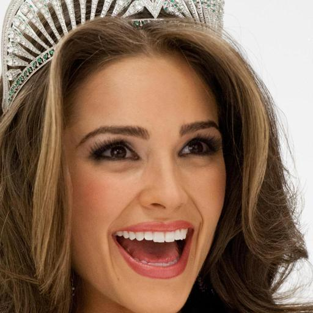
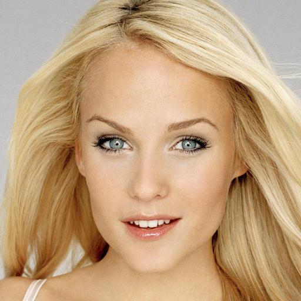
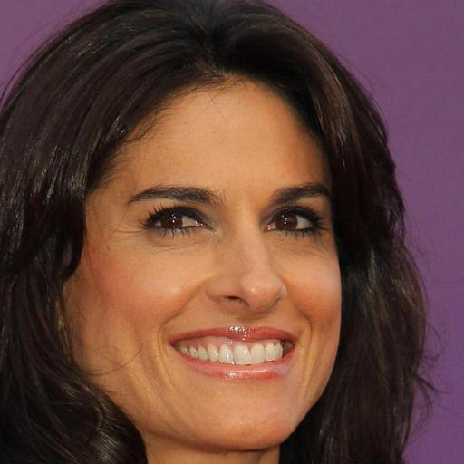
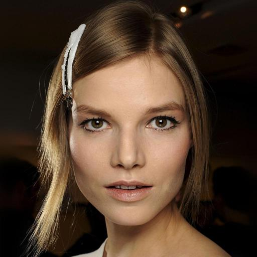
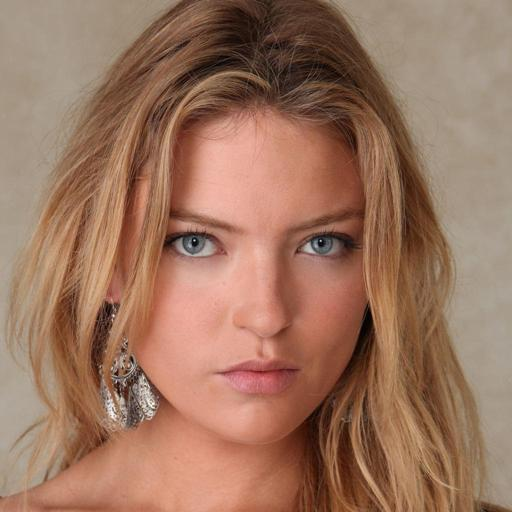
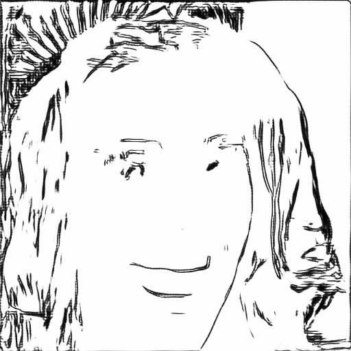
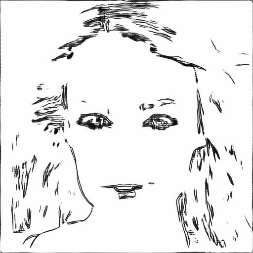
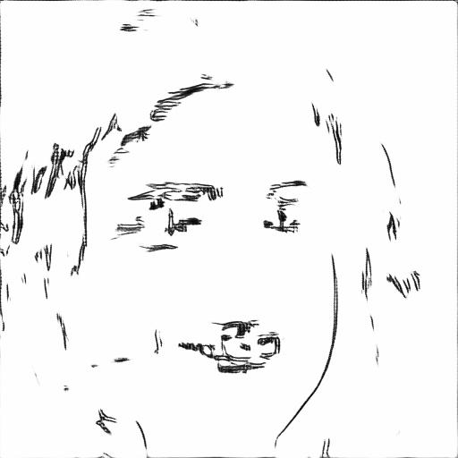
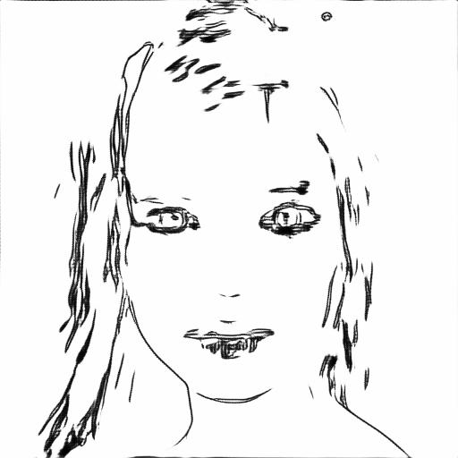
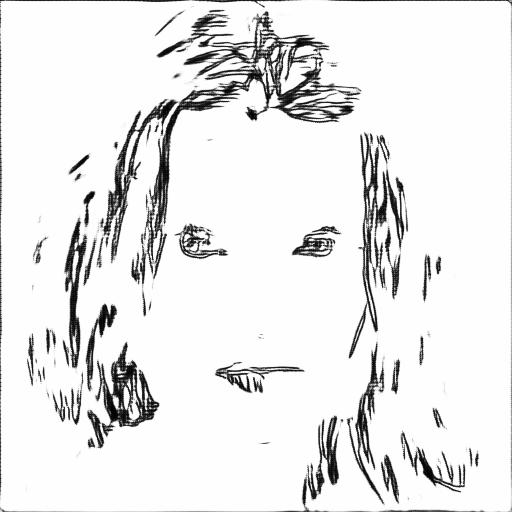

# [Person Face Sketches](https://www.kaggle.com/datasets/almightyj/person-face-sketches)

 

<table>
  <tr>
    <td></td>
    <td></td>
    <td></td>
    <td></td>
    <td></td>
  </tr>
  <tr>
    <td></td>
    <td></td>
    <td></td>
    <td></td>
    <td></td>
  </tr>
</table>

## About Dataset

Images were taken from the [CelebAMask-HQ](https://github.com/switchablenorms/CelebAMask-HQ) dataset without `Eyeglasses`, `Wearing_Hat` attributes, and `Yaw`, `Pitch`, `Raw` absolute degrees equal or less than 20.

Then theses images were filtered with `ImageFilter.FIND_EDGES`, `ImageFilter.BLUR`, `ImageFilter.SHARPEN`, `ImageOps.invert()` and `ImageEnhance.Contrast().enhance(1.5)` sequentially to produce rought sketches. Furthermore, theses rought skecthes are simplified using [Sketch Simplification](https://esslab.jp/~ess/research/sketch/).

---

This project was developed as part of Nodeflux Internship x Kampus Merdeka.